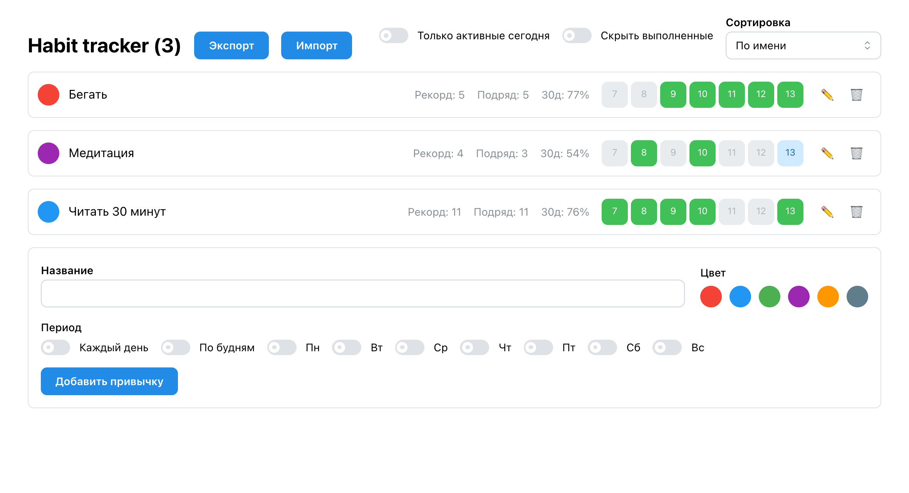

# Habit Tracker

Трекер привычек: отмечай дни, следи за стриком и процентом за 30 дней.
Пет-проект для практики React + TypeScript. Цель — самостоятельно пройти весь цикл:
стор и бизнес-логика, валидация данных на границе доверия, тесты, UI.



## Возможности

- Привычки с цветом и расписанием: каждый день / будни / свои дни недели
- Отметки за последние 7 дней; будущие дни и дни до создания привычки заблокированы
- Текущий и лучший стрик с учётом расписания — пропуск незапланированного дня не рвёт серию
- Процент выполнения за 30 дней
- Фильтры («только активные сегодня», «скрыть выполненные») и три сортировки
- Инлайн-переименование, удаление
- Экспорт/импорт JSON с валидацией и человеческими сообщениями об ошибках
- Данные живут в localStorage

## Стек

React · TypeScript · Vite · Zustand (immer, persist) · Mantine · date-fns · Zod · Vitest

## Запуск

```bash
npm install
npm run dev      # http://localhost:5173
npm test         # юнит-тесты
```

## Решения, которыми горжусь

**Импорт как граница доверия.** Экспорт и импорт JSON нужны, чтобы переносить историю привычек между устройствами. Но импортируемый файл — это данные неизвестной формы: проверки TypeScript в работающем приложении уже не действуют (типы стираются при сборке), и битый файл молча сломал бы стор. Поэтому импорт целиком проходит через zod-схему, которая проверяет данные во время работы приложения, а TS-типы выводятся из неё через `z.infer`. Кроме формы данных схема проверяет две вещи: формат ключей-дат в записях о выполнении (файл с ключами-таймстемпами импортировался бы «успешно», но все отметки стали бы невидимыми, потому что приложение ищет `yyyy-MM-dd`) и то, что каждая отметка принадлежит существующей привычке — отметки без хозяина импортировать нельзя. Любая ошибка валидации показывается пользователю кастомным сообщением в тосте, а не ломает приложение.

**Стрик по расписанию, а не по календарю.** Стрик и лучший стрик добавлены, чтобы пользователь видел пройденный путь. Серия считается по расписанию привычки: если привычка запланирована на Пн/Ср/Вс, то пропущенный вторник её не рвёт. Плюс льгота на сегодня: незавершённый сегодняшний день не прерывает серию — она обрывается только после реально пропущенного запланированного дня. Обе функции работают и с ежедневным режимом, и с кастомными расписаниями.

**Чистое ядро дат.** Вся логика стриков и статистики — чистые функции в `lib/dates.ts`: на входе данные, на выходе число. React, стор и браузер им не нужны. Поэтому тесты на них писать просто: вызвал функцию с готовыми данными, сравнил результат — без рендера и моков. Покрыто самое хрупкое место проекта: льгота, кастомные расписания, провалы серии и все сценарии валидации импорта. Тесты окупились ещё в разработке: один из них поймал ошибку в массиве расписания, которую TypeScript не видел из-за каста типа.

**Два стора с разным временем жизни данных.** Zustand-стор поделён на `habitsSlice` и `uiSlice` по простому принципу: что должно пережить перезагрузку страницы, а что нет. Привычки и отметки обёрнуты в persist и лежат в localStorage; фильтры и сортировка — состояние экрана, после перезагрузки они сознательно сбрасываются к дефолту. Middleware immer даёт мутабельный синтаксис при иммутабельных обновлениях, а точечные селекторы (state => state.habits) не дают компонентам ререндериться на чужие изменения.

## Тесты

Покрыто самое хрупкое: расчёт стриков (льгота на сегодня, кастомные расписания, провалы)
и валидация импорта (битый JSON, невалидные даты, висячие id). 19 тестов, vitest.
